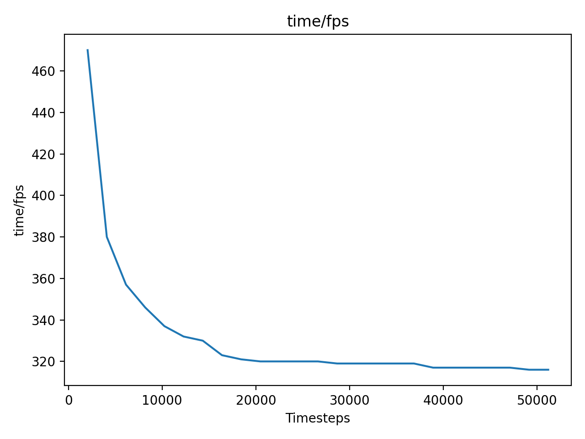
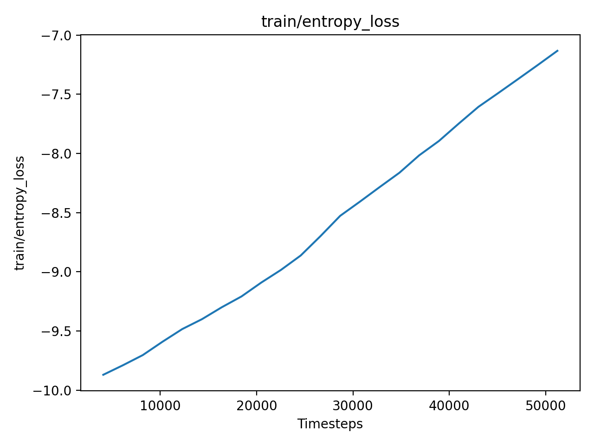
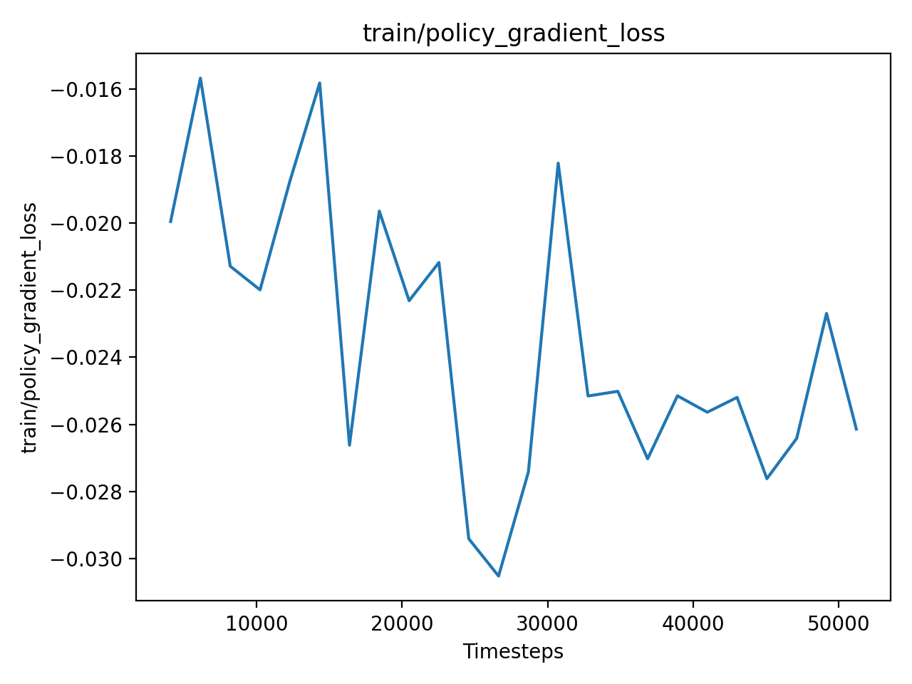
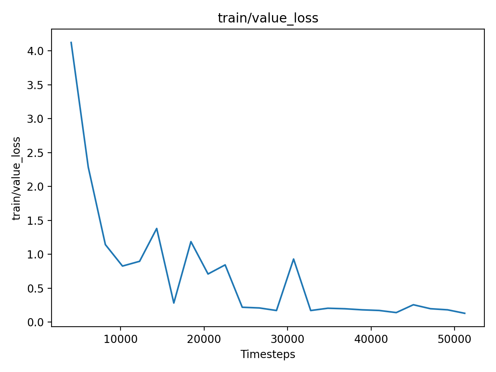

# 🥷 Samurai-Reflex-RL

### Reinforcement Learning for Robotic Sword Parrying in PyBullet


Samurai-Reflex-RL is a robotics project exploring **defensive reflex learning** using reinforcement learning (PPO) inside a custom PyBullet simulation.  

A 7-DOF robotic arm learns to **react and parry** incoming sword attacks from an opponent robot using continuous control.


This repository contains the full environment, training code, evaluation pipeline and reproducible setup scripts.


---


 ## ✨ Features


- 🗡️ **Scripted opponent attack model** with curved Bézier sword arcs  

- 🛡️ **PPO-trained defensive policy**  that learns parry reflexes  

- 🔁 **Cooldown-based parry detection metric** (fixes false positives)  

- 📊 Automatic **evaluation graphs**: rewards, parries, distributions  

- 🧪 **Deterministic evaluation** over 50 episodes  

- ⚙️ Fully reproducible **UV-powered Python 3.10 environment**  

- 🪶 Stable-Baselines3 + PyBullet + Gymnasium integration  

---

## NOTE

- The code contains two folders which have trained models for steady guard & defensive stance
- You can copy paste all files and replace the files within the respective directory where all the py files reside
- Then run
  ```bash
  python eval_samurai.py
  ```

  This shows the right run for each type of defensive training style

---

## Docker Running Setup

- First run the following command to build the container
```bash
docker-compose build 
```

- Now run the container with
```bash
docker-compose run --rm -e DISPLAY=host.docker.internal:0.0 -e LIBGL_ALWAYS_INDIRECT=1 samurai-rl bash
```

- Run the Samurai bot evaluation file with
```bash
python SamuraiProject/eval_samurai.py
```
---

 # ⚙️ Installation  & Environment Setup (Windows + UV) without docker


This project uses **Python 3.10** because PyBullet wheels do not support 3.11+.  

We use  **UV** for a clean and stable virtual environment.

##$ PROJECT RUNS BASED ON NVIDIA CUDA

- Please ensure you have a working gpu or tensor on your device
- Identify and get the right device drivers (ensure to upgrade them to the latest)
- Have the correct CUDA or CuDnn driver as well

Note: Project was tested using RTX 3080 10gb OC - CUDA 12.1


 ### 1️⃣ Install UV


```bash
pip install uv
```

1. Clone this repository
2. setup uv outside the folder
   

 ### 2️⃣ Create environment (Python 3.10 required)

```bash
uv venv samurai_rl --python 3.10
```


If you have a global path for python version above 3.10, (ie. 3.11 and above use) after installing 3.10.


```bash
py -3.11 -m uv venv samurai_rl --python 3.10
```


 ### 3️⃣ Activate environment


```bash
.\samurai_rl\Scripts\activate
```


 ### 4️⃣ Install dependencies


```bash

pip install torch==2.5.1 torchvision==0.20.1 torchaudio==2.5.1 --index-url https://download.pytorch.org/whl/cu121

pip install "gymnasium [all]==1.2.2"

pip install "stable-baselines3 [extra]==2.2.1"

pip install https://github.com/bulletphysics/bullet3/releases/download/3.25/pybullet-3.25-cp310-cp310-win _amd64.whl

pip install matplotlib numpy

```

### 5️⃣ Change directory while in uv

```bash
cd SamuraiProject
```

### 6️⃣ For final sanity check
Install all requirements with correct versions to ensure smooth running

```bash
pip install -r requirements.txt
```
---


 # 🧠 Technical Overview


 # 🗡️ Opponent Attack Model


 *Attacks are not random — they follow a realistic sword swing using: *


* Quadratic Bézier curve interpolation
* Wind-up → Strike → Follow-through phases
* Random lateral offsets for realism
* Continuous updates per simulation step
* This produces lifelike attack trajectories that the agent must defend against.


---


 # 🔁 Cooldown-Based Parry Detection


Originally the system counted every contact frame as a “parry”, inflating numbers.


 *fixed this using:*

* Sliding cooldown window (≥ 15 steps)
* Spatial position check
* Blade orientation check
* Contact force validation


Such as:

Mean parries per episode: 3.02

Total parries: 151

Total hits: 0

Parry rate: 100%


---


 # 🥋 Training the Agent


```bash

python train.py

```


This will:


* CLI Training mode
* Train for N timesteps
* Save model to: models/samurai _ppo.zip


---


 # 🔬 Evaluation


 *Use event-based parry metric:*


```bash

python evaluate.py

```


 *NOTE:*

* Running this without training works as a dry run
* It uses base reward system idea
* Running after training will show trained results


Output summary:


Mean reward: 8.66

Mean episode length: 200

Mean parries/episode: 3.02

Parry rate: 100%

Total hits: 0


---
# Metrics for Training

<table>
  <tr>
    <td width="50%">
      
    </td>
    <td width="50%">
      
    </td>
  </tr>
  <tr>
    <td width="50%">
      
    </td>
    <td width="50%">
      
    </td>
  </tr>
</table>

---
 # 🚧 Known Limitations


* Opponent is scripted (not a learning agent)
* No real sensor noise or actuation latency
* Parry angle thresholds still coarse
* No domain randomization yet
* Designed for Windows; Linux requires PyBullet wheel rebuild


---
